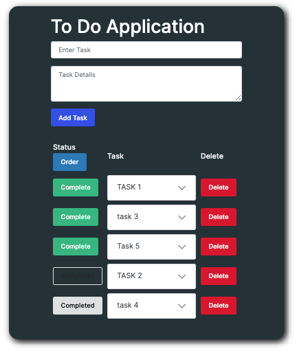

# SQL TO DO LIST APPLICATION

Weekend Challenge.

## Description

This project is a To Do List App that accepts inputs for a task and details and stores that task on a SQL database using a POST request and pg query.  The task can be completed with a click of a button (PUT request) and deleted (DELETE request).  The tasks are also pulled from the database and displayed on the DOM with a GET request.  Query params were used to allow the user change the display order.

To Do List Functionality - 
 - A task and details can be entered into the text inputs (49 and 349 characters, respectively).
 - Add Task will collect the inputs then POST and INSERT INTO the database.
 - Database tasks are displayed on the DOM as accordion buttons.  The Task is the primary text and the details are revealed when the accordion button is clicked.
    - Each task is appended with 'Complete' and 'Delete' buttons.
 - The complete will change the status to Completed and 'grey out' the button. The status can be reset by clicking the 'greyed out' Completed button.
 - The delete button will activate a modal, verifying that the user wants to permanently delete the task from the database.  By clicking DELETE on the modal, the task is removed from the DOM and database.
 - An 'Order' button is present under Status, which reverses the order of the tasks, so completed tasks are on top.
    - Tasks are inherently ordered by non-completed on top, completed on bottom, then by database id.

## Screenshot

Image of [To Do App](https://github.com/matthewbouc/weekend-sql-to-do-list/blob/master/server/Images/To%20Do%20App.png).

[Completed Status](https://github.com/matthewbouc/weekend-sql-to-do-list/blob/master/server/Images/To%20Do%20App-completes.png).

[Modal](https://github.com/matthewbouc/weekend-sql-to-do-list/blob/master/server/Images/To%20Do%20App-modal.png).

## Installation:

 - Fork and clone repo
 
 - 'npm install'
 - 'npm start'
 
 - database.sql can be used for postgreSQL database

 - http://localhost:5000

## Built With:

- html/css
- Bootstrap
- jQuery
- Ajax
- Node/Express
- PostgreSQL

## Future Development:

- Don't allow empty Task - empty details OK
- Improve query param - don't allow it to reset after GET request
- Include dates: task created and task completed